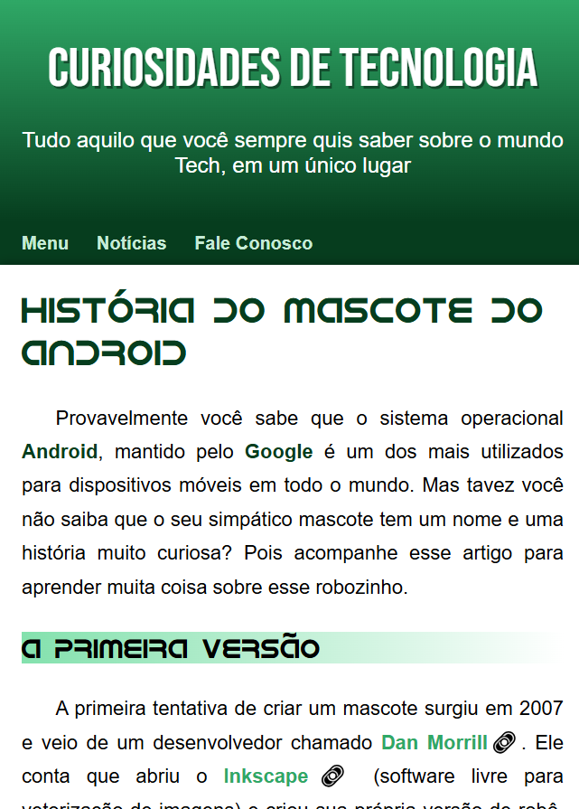
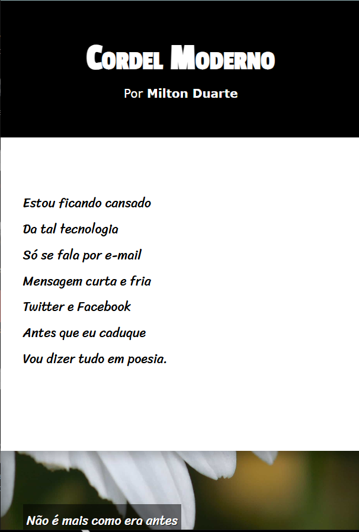

Curso de HTML5 e CSS3 - Colocando em Prática

Páginas desenvolvidas durante atividades do Curso em Vídeo, do professor Gustavo Guanabara, onde colocamos em prática:

- Conceitos de Design;
- Mídias e Direitos Autorais;
- HTML5, CSS3 e Responsividade.

---

## Landing Page "História do Mascote do Android" (Desafio 10) ##

### Tecnologias:
- HTML5
- CSS3

### Preview:

### Acesse Online:
https://dilene-carvalho.github.io/Estudos/desafio_10/

---

## Projeto Cordel

### Tecnologias
- HTML5
- CSS3

### Preview

### Acesse online:
https://dilene-carvalho.github.io/Estudos/projeto-cordel/

